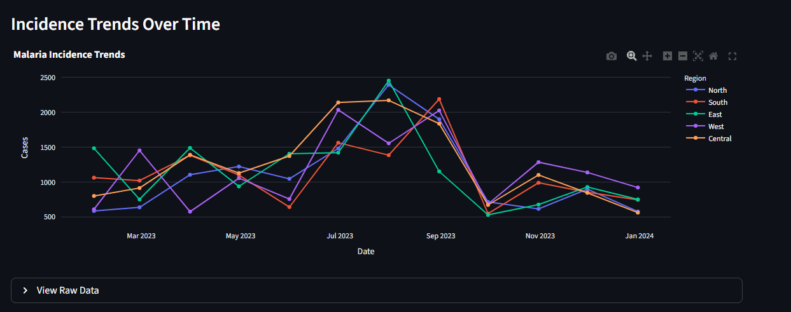

### Ongoing Project & Learning
I'm still using dummy data for now

# 🦟 Malaria Surveillance Dashboard

A web-based malaria surveillance dashboard built with **Python** and **Streamlit** to visualize, monitor, and analyze malaria trends for data-driven public health decision-making.

---

## 📌 Features

- Interactive visualizations of malaria cases and trends  
- Filters by **location**, **time period**, and **demographic variables**  
- Summary statistics and key surveillance indicators  
- User-friendly web interface powered by Streamlit  
- Supports static or regularly updated datasets (CSV, Excel, or database)

---

## 🛠️ Tech Stack

- **Python 3.8+**
- **Streamlit**
- **Pandas**
- **NumPy**
- **Plotly / Matplotlib / Seaborn**  

---

## 🚀 Getting Started

### 1️⃣ Clone the Repository

```bash
git clone https://github.com/EarlyBloomer-byte/Dashboard.git
cd Dashboard
```
### 2️⃣ Create and Activate a Virtual Environment (Recommended)

```bash
python -m venv venv
source venv/bin/activate   # On Windows: venv\Scripts\activate
```

### 3️⃣ Install Dependencies

```bash
pip install -r requirements.txt
```

### 4️⃣ Run the Dashboard

```bash
streamlit run app.py
```

The application will automatically open in your browser


<table>
  <tr>
    <td></td>
    <td></td>
  </tr>
</table>
